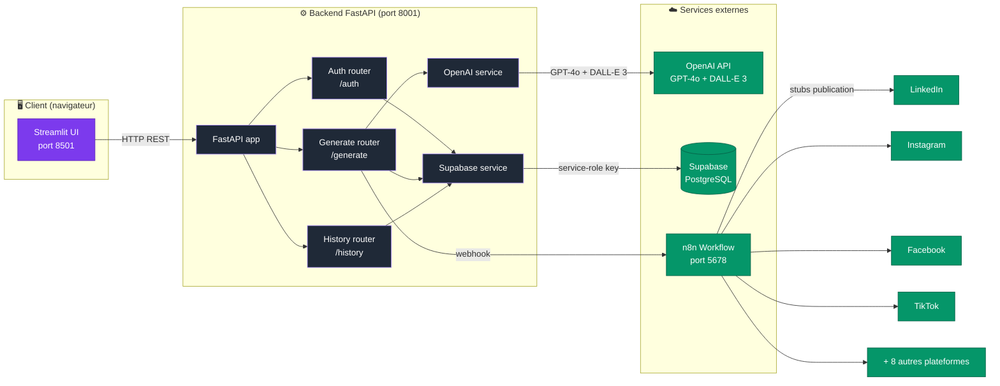
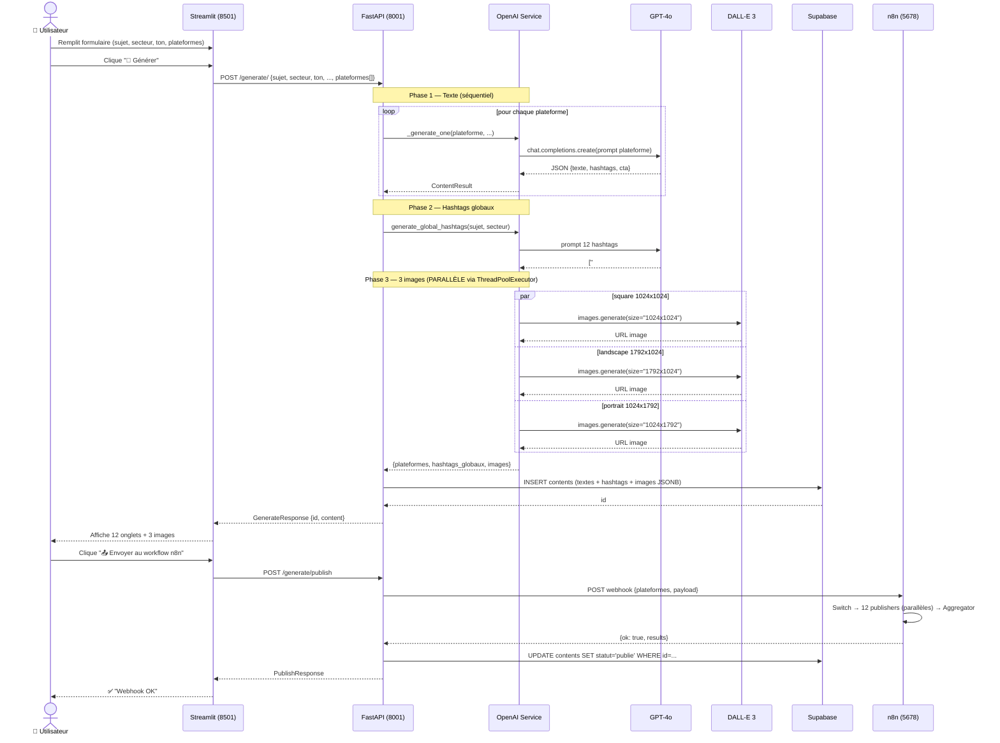
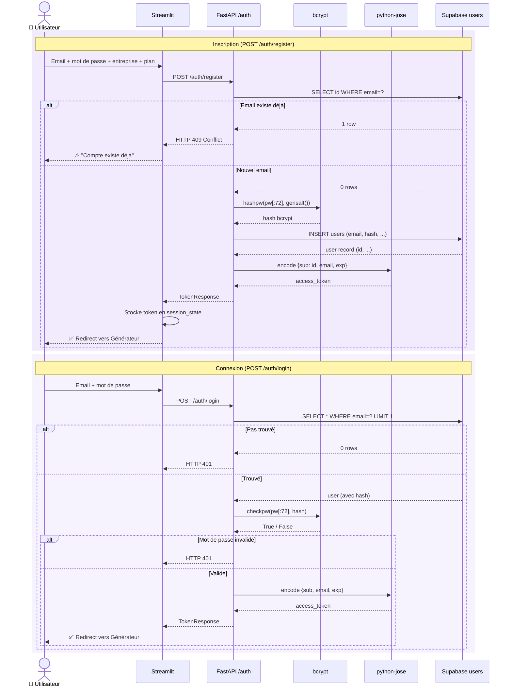
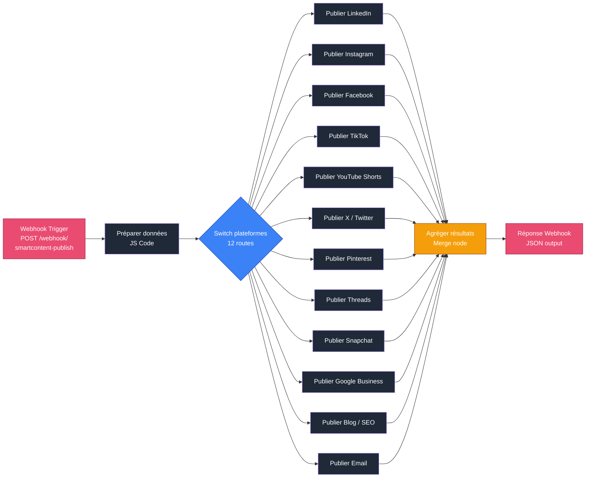

# 🏗 Architecture & Schémas UML — SmartContent AI

Ce document contient les **4 diagrammes** principaux du système, exprimés en **Mermaid** (rendu automatique sur GitHub).

Pour les exporter en PNG/SVG (utile dans le mémoire ou les slides) :
1. Va sur https://mermaid.live
2. Colle le code du bloc ` ```mermaid ` voulu
3. Clique **Actions → PNG / SVG**

---

## 1. Architecture système (vue d'ensemble)

Composants principaux et flux de données.



---

## 2. Diagramme de séquence — Génération de contenu

Flux complet d'une génération multi-plateformes avec images DALL-E 3.



---

## 3. Diagramme de séquence — Authentification

Inscription puis connexion avec bcrypt + JWT.



---

## 4. Diagramme entité-relation (DB Supabase)

Tables `users` et `contents` avec relations.

```mermaid
erDiagram
    USERS ||--o{ CONTENTS : "génère"

    USERS {
        UUID id PK "gen_random_uuid()"
        TEXT email UK "unique"
        TEXT password_hash "bcrypt"
        TEXT nom_entreprise "nullable"
        TEXT plan "free | pro | premium"
        TIMESTAMPTZ date_inscription "default NOW()"
    }

    CONTENTS {
        UUID id PK "gen_random_uuid()"
        UUID user_id FK "ON DELETE CASCADE"
        TEXT sujet "required"
        TEXT secteur "ex: Restaurant"
        TEXT ton "ex: Storytelling"
        TEXT objectif "ex: Vendre"
        TEXT type_contenu "ex: Post simple"
        JSONB plateformes "[\"linkedin\", \"tiktok\", ...]"
        JSONB content "Textes + hashtags + images"
        JSONB images "{square, landscape, portrait}"
        TEXT statut "draft | publie | erreur"
        TIMESTAMPTZ date_creation "default NOW()"
    }
```

### Index PostgreSQL
- `idx_users_email` sur `users(email)` — accélère le login
- `idx_contents_user_id` sur `contents(user_id)` — accélère la page Historique
- `idx_contents_date_creation` sur `contents(date_creation DESC)` — accélère le tri

### RLS (Row Level Security)
**Désactivé** sur les 2 tables. Le backend utilise la **service-role key** Supabase qui bypass RLS. Pour la prod, RLS sera réactivé avec policies par `user_id`.

---

## 5. Schéma du workflow n8n

Vue d'ensemble du workflow d'orchestration multi-plateformes (17 nodes).



**Latence mesurée en mode production** : ~120 ms pour les 12 publishers en parallèle (hors temps OpenAI).

---

## 📐 Légende des couleurs (cohérence avec le frontend)

| Couleur | Hex | Usage |
|---|---|---|
| 🟣 Violet primary | `#7c3aed` | Brand / boutons / accents |
| 🟪 Accent | `#a78bfa` | Hover / liens / highlight |
| ⚫ Background dark | `#0e1117` | Fond principal |
| ⬛ Background card | `#161a26` | Cartes / sidebar |

---

*Schémas générés en Mermaid v11+ — rendu automatique sur GitHub. Pour export PNG/SVG, utiliser https://mermaid.live*
